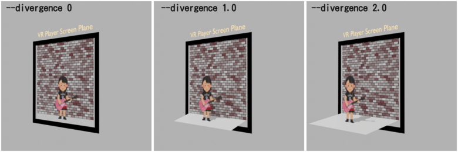
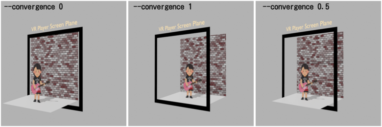

# iw3

I want to watch any 2D video as 3D video on my VR device, so I developed this very personal tool.

iw3 provides the ability to convert any 2D image/video into side-by-side 3D image/video. However, it does not support Anime.

This project is under construction.

## Overview

- Estimating depthmap using [ZeoDepth](https://github.com/isl-org/ZoeDepth)
- Generating side-by-side image using grid_sample based lightweight model that is trained with [stable-diffusion-webui-depthmap-script](https://github.com/thygate/stable-diffusion-webui-depthmap-script) 's method

## Usage

### GUI (experimental)

Run `iw3.gui` module from the root directory of nunif.

```
python -m iw3.gui
```
with `--lang` option
```
python -m iw3.gui --lang ja_JP
```

### CLI

Run `iw3` module from the root directory of nunif.

```
python -m iw3 -i <input file or directory> -o <output file or directory>
```

When specifying a directory with the `-i` option, only image files within that directory will be processed.

If you want to process multiple video files, create a text file (e.g., `video_list.txt`) and list the file names inside it, with each file name on a new line. Then, specify the the text file, such as `-i video_list.txt`. Note that the text file is assumed to be in UTF-8 encoding.

```
python -m iw3 -i video_list.txt -o output_dir
```

The following command shows all available options:
```
python -m iw3 -h
```

Also, when running `iw3` for the first time, it may take some time as it needs to download large model files.

### What is `--divergence`(`-d`) option?



`2.0` by default. You can also specify `2.5`.

### What is `--convergence`(`-c`) option?



- `0` is good, but screen edge areas are hard to see.
- `1` is the most friendly for curved display setting.
- `0.5` by default.

## About VR Player

I have tested the results with the following software.

### Pigasus VR Media Player

Pigasus works perfectly for SBS 3D videos, images, and Samba drive(SMB).
However, I am not a big fan of its user interface and user experience.

If you can only choose one software, I would recommend this one.

### SKYBOX VR Video Player

I like this user interface, but 

- Loading image files from Samba drive is not supported (from the internal drive is supported)
- SBS 3D videos do not play with correct aspect ratio (See https://forum.skybox.xyz/d/407-full-sbs-3d , if the aspect ratio is a typical aspect ratio such as 4:3 or 16:9, you can manually fix it)
- Low FPS videos do not seek correctly (maybe FPS < 15)

Summary: If you want to play SBS videos with typical aspect ratio and fps, this software works.

## About file naming rule

VR Player detects media format by filename.
Adding `_LRF` suffix to the filename will identify the file as full side-by-side 3D media.

When specifying a directory with the `-o` option, it is automatically output as a filename with `{original_filename}_LRF.(png|mp4)`.

## VR180 format

When `--vr180` option is specified, the video is output in VR180 format (equirectangular).

This is usually not recommended because of poor usability during playback.

This is useful if your video player does not have the ability to play SBS 3D videos or if you want to post the video on Youtube.

## Trouble shooting

### Very flat foreground

This tends to happen with outdoor scene photos.

There are some ways.
- Try `--mapper softplus2` option
- Try`--remove-bg` option

When `--mapper softplus2` is specified, the depthmap is remapped to see big differences on the foreground side. [mapper functions](https://github.com/nagadomi/nunif/assets/287255/0071a65a-62ff-4928-850c-0ad22bceba41)

When `--remove-bg` is specified, the background area is removed using [rembg](https://github.com/danielgatis/rembg) with [U2-net](https://github.com/xuebinqin/U-2-Net)'s human segmentation model, before estimating depthmap.

### Video encoding error

Please post to the issue about the format of the video.

### 60fps video drops to 30fps

By default, it is limited to 30fps.
Use `--max-fps 128` option.

### It's a giant!

This is a problem with SBS 3D video that it cannot be rendered in actual size scale.

You can try adjusting scale manually.

1. Use `--pad` option to adjust the frame scale
2. Adjust IPD scale 

On SKYBOX Player, set the 3D effect slider to around < -0.3.

On Pigasus, set `Settings > Advanced Settings > IPD` slider to large.

Also, on Pigasus, you can zoom and pan the image by double-clicking the trigger button on the VR controller.

### CUDA Out of Memory

Try `--disable-zoedepth-batch` option.

I tested this program on RTX 3070 Ti (8GB VRAM).
Perhaps 4GB VRAM should be enough to run this program.

### How to convert rotated(height width swapped) video correctly

Use `--rotate-left`(rotate 90 degrees to counterclockwise) or `--rotate-right`(rotate 90 degrees to clockwise) option to fix the rotation.

### Video is interlaced

Use `--vf yadif` option to deinterlace the video source.
You can use ffmpeg's video filter with `--vf` option.

Note that
- only serial pipeline is supported

See https://ffmpeg.org/ffmpeg-filters.html

### Recommended workflow for slow processor or very large video

1. First check the results with a few samples. There are two ways.

The following command processes video keyframes about every 4 seconds and outputs the result as 3D photos (image files).
```
python -m iw3 --keyframe --keyframe-interval 4 -i input_video.mp4 -o output_dir/
```

The following command processes video frames every 2 seconds and outputs the result as 3D slideshow-like video (video file).
```
python -m iw3 --max-fps 0.5 -i input_video.mp4 -o output_dir/
```

If the results are acceptable, process the full video.

## Limitation

`--method row_flow`(by default) is currently only supports (`0 <= divergence <= 2.5` and `input width <= 1920`).
