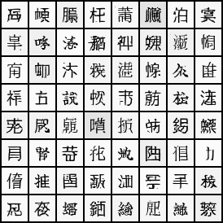

# GAN

Repository for playing/studing with Generative Adversarial Network.

## DCGAN Kanji Fonts

In 2023, I made my first attempt at DCGAN training.

`train_font_dcgan.py` trains Deep convolutional GAN with JIS Level-1 Kanji(2965 characters) and 8 different font files.

```
# download font files
python -m font_resource.download_google_fonts
# training
python -m playground.gan.train_font_dcgan --data-dir ./tmp/dcgan --model-dir ./tmp/dcgan
```
The generated images are saved in `tmp/dcgan`.

Here is a generated image.



There are several Kanji characters that can be read such as `泊`, `枉`, `恫`, `花`, etc. This may be overfitting the training data.

The architecture is a bit more complex than the reference implementation.
Two discriminators are used: low level feature discriminator and high level feature discriminator.
