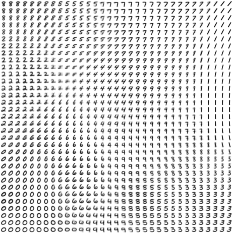
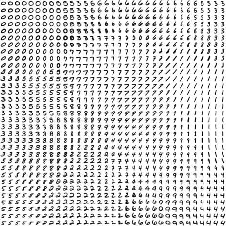

# SOM: Self-Organizing Map

Pytorch implementation of Kohonen's Self-Organizing MAP.

- Fast direct updates with mini-batch on GPU (using optim is slow)
- Initialize map center with centroid of data

This code does not require nunif library.
```
python3 -m playground.som.train_mnist
```
The generated images are saved in `tmp/som`.



# AE-SOM

Autoencoder based Deep Convolutional SOM that I designed at random.

```
python3 -m playground.som.train_aesom_mnist
```


It's less blurry.
