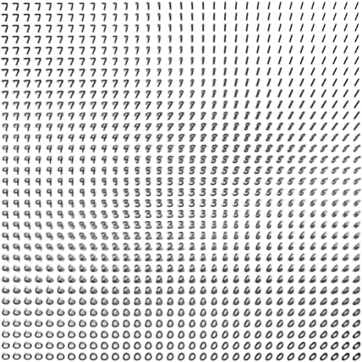
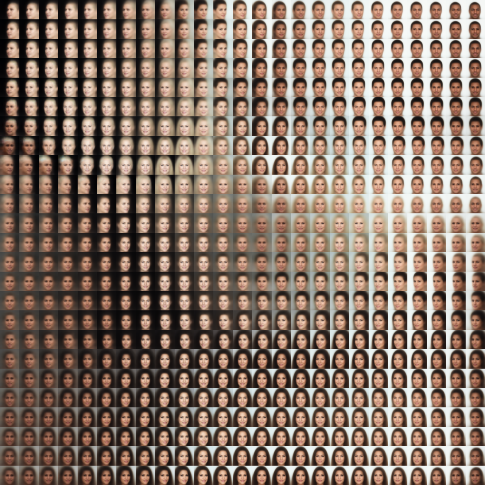

# VAE

Repository for my playing/studying with Variational Autoencoder.

# MNIST Map

```
python3 -m playground.vae.train_mnist --data-dir ./tmp/vae --model-dir ./tmp/vae
```
The generated images are saved in `tmp/vae`.



similar to [SOM](../som), but closer to the center, closer to the mean.

What I found interesting is that the center image is generated from all 0 inputs.
It means that decoder's bias terms stores the center image.

# CelebA Map

```
python3 -m playground.vae.train_celeba --data-dir ./tmp/vae --model-dir ./tmp/vae_celeba --latent-dim 2
```


It seems difficult to generate hair with variations.
Also, background color and face orientation seem to be strongly affected due to the pixel level loss function.

